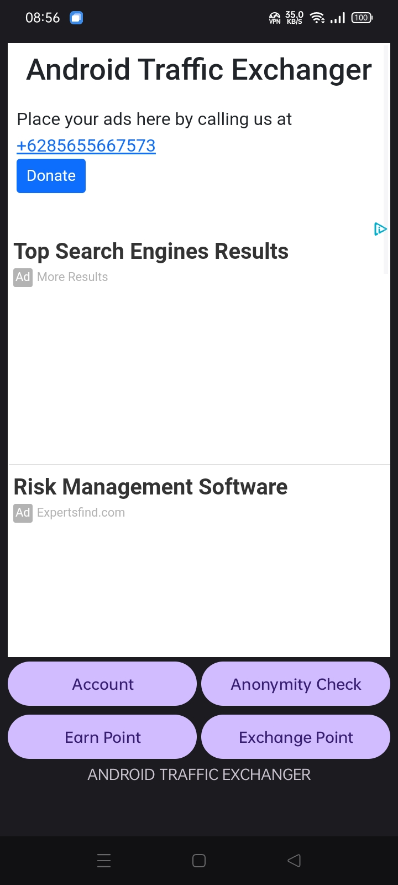
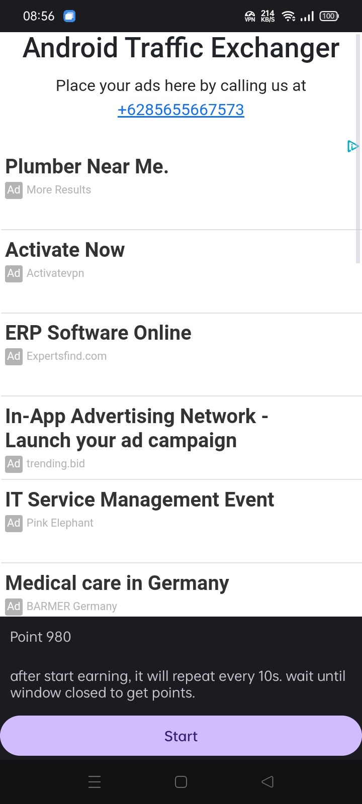
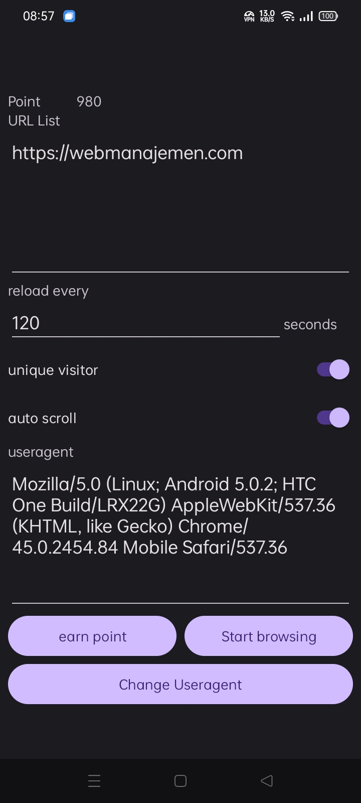

# Android Traffic Exchanger
Website Traffic Exchange App For Android

Drive traffic to your website everytime everywhene just using android.

## Features

- [x] unique visitor
- [x] override useragent
- [ ] Disable WebRTC
- [x] local exchanger
- [x] override referer
- [ ] override custom header
- [ ] override proxy
- [ ] push url to global exchanger
- [x] auto scroll top - bottom ↻

## Requirements
- Android 8.0 (Oreo): API level 26
- Internet Connection
- Google Account

## Preview

|      |        |      |
| :--- | :----: | ---: |
|  |  |  |

## Download

| App Name | Description |
| :--- | :--- |
| [Installer Manager](https://github.com/dimaslanjaka/android-traffic-exchange/raw/master/release/manager-release.apk) | Installer manager app based on device architecture |
| [Android Traffic Exchanger](https://github.com/dimaslanjaka/android-traffic-exchange/raw/master/release/manager-release.apk) | Exchange url with others to visit your website |

## Develop Requirements
- JDK-21

## Develop Tools
- release https://github.com/dimaslanjaka/android-traffic-exchange/tree/master
- launcher icon generator https://icon.kitchen/i/H4sIAAAAAAAAA12OsQ7CMAxE%2F%2BXmfkF3Ria6IQYncdKoCYG4AaGq%2F06MGBCLJT%2Ff%2BW7Dg1JjwbjBUV2mmTNj9JSEB%2FgwvW59RcwUGAqOJMvP%2FeA927XbIbZUlZh%2FjwmnmT5E7i1WmxSumuO%2Bj%2FYBubiWtMYZdHW1RNdFsUifTza47G%2FfraR1qQAAAA%3D%3D
- to replace previous icon https://developer.android.com/codelabs/basic-android-kotlin-compose-training-change-app-icon#4
- loading animation https://github.com/MohamedAbulgasem/LoadingOverlay

## Tricks

- logcat error filter

```bash
package:com.dimaslanjaka.blog -tag:parcel level:error level:warn -message:GuiExtAuxCheckAuxPath -message:.so
package:com.dimaslanjaka.blog -tag:chromium -tag:gpuaux -tag:parcel -tag:chatty level:error -message:libcolor
```

- git push large file

```bash
git config --global http.postBuffer 1048576000
git config --global lfs.dialtimeout 60
git config --global lfs.transfer.maxretries 5
git config --global lfs.concurrenttransfers 1
git config --global lfs.activitytimeout 600
```